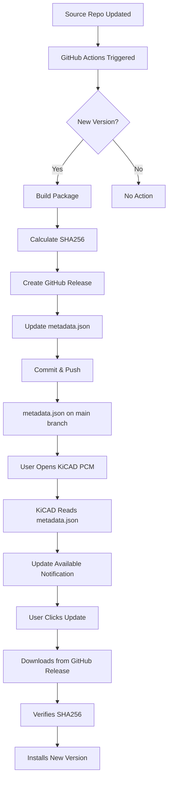

# GitHub Actions Automation Guide

**Automated Plugin Updates for KiCAD Plugin Manager**  
**Date**: February 20, 2026

---

## 📖 Overview

This repository uses GitHub Actions to **automatically** detect, build, package, and deploy plugin updates when the source repositories are updated. This follows KiCAD's Plugin Content Manager (PCM) update methodology.

### What's Automated

✅ **Version Detection** - Automatically detects new versions from source repositories  
✅ **Package Building** - Creates KiCAD-compatible plugin packages (.zip files)  
✅ **SHA256 Calculation** - Computes package checksums automatically  
✅ **GitHub Releases** - Creates releases with proper tags and descriptions  
✅ **Metadata Updates** - Updates `metadata.json` with new version information  
✅ **KiCAD PCM Integration** - Users get automatic update notifications in KiCAD

---

## 🤖 Available Workflows

### 1. Auto-Update OpenFixture ([.github/workflows/update-openfixture.yml](.github/workflows/update-openfixture.yml))

**Triggers**:
- 🕒 **Scheduled**: Daily at 2 AM UTC (checks for updates)
- 🔔 **Repository Dispatch**: When source repo sends notification
- 👆 **Manual**: Via GitHub Actions UI

**What it does**:
1. Checks OpenFixture source repository for new versions
2. Compares with current version in metadata.json
3. If new version found:
   - Builds plugin package
   - Calculates SHA256 hash
   - Creates GitHub release
   - Updates metadata.json
   - Commits changes
   - Users see update in KiCAD Plugin Manager

### 2. Auto-Update EMC Auditor ([.github/workflows/update-emc-auditor.yml](.github/workflows/update-emc-auditor.yml))

**Triggers**:
- 🕒 **Scheduled**: Daily at 2 AM UTC
- 🔔 **Repository Dispatch**: When source repo sends notification
- 👆 **Manual**: Via GitHub Actions UI

**Process**: Same as OpenFixture but for EMC Auditor plugin

### 3. Validate Repository ([.github/workflows/validate.yml](.github/workflows/validate.yml))

**Triggers**:
- 📝 **Push**: On every commit to main/develop branches
- 🔀 **Pull Request**: On PRs to main branch
- 👆 **Manual**: Via GitHub Actions UI

**Validates**:
- ✅ JSON syntax correctness
- ✅ Repository structure completeness
- ✅ Metadata schema compliance
- ✅ URL accessibility

---

## 🚀 Setup Instructions

### Initial Setup (One-Time)

#### 1. Enable GitHub Actions

```bash
# In your repository settings:
Settings → Actions → General → Allow all actions
```

#### 2. Set Required Permissions

```bash
# Settings → Actions → General → Workflow permissions
Select: "Read and write permissions"
Enable: "Allow GitHub Actions to create and approve pull requests"
```

#### 3. Test Workflows

```bash
# Go to Actions tab in GitHub
# Select a workflow (e.g., "Validate Repository")
# Click "Run workflow"
# Verify it completes successfully
```

---

## 📋 How to Trigger Updates

### Method 1: Automatic (Recommended)

**Daily Scheduled Checks**:
- Workflows run automatically every day at 2 AM UTC
- They check source repositories for version changes
- If new version detected → automatic update process starts
- No manual intervention required

### Method 2: Manual Trigger

**Via GitHub UI**:

1. Go to your repository on GitHub
2. Click **Actions** tab
3. Select workflow (e.g., "Auto-Update OpenFixture")
4. Click **Run workflow** button
5. Fill in parameters:
   - **version**: New version number (e.g., `2.0.1`)
   - **source_tag**: Git tag/branch from source repo (e.g., `v2.0.1` or `main`)
6. Click **Run workflow**

**Via GitHub CLI**:

```bash
# Trigger OpenFixture update
gh workflow run update-openfixture.yml \
  -f version=2.0.1 \
  -f source_tag=v2.0.1

# Trigger EMC Auditor update
gh workflow run update-emc-auditor.yml \
  -f version=1.4.1 \
  -f source_tag=v1.4.1
```

### Method 3: Repository Dispatch (Advanced)

**From Source Repository**:

Configure source repository to send notifications when releases are created:

`.github/workflows/notify-plugin-repo.yml` (in source repo):

```yaml
name: Notify Plugin Repository

on:
  release:
    types: [published]

jobs:
  notify:
    runs-on: ubuntu-latest
    steps:
      - name: Trigger plugin update
        run: |
          curl -X POST \
            -H "Accept: application/vnd.github.v3+json" \
            -H "Authorization: token ${{ secrets.PLUGIN_REPO_TOKEN }}" \
            https://api.github.com/repos/RolandWa/KiCAD-Plugin/dispatches \
            -d '{"event_type":"openfixture-release","client_payload":{"version":"${{ github.event.release.tag_name }}"}}'
```

**Setup**:
1. Create Personal Access Token with `repo` scope
2. Add as secret `PLUGIN_REPO_TOKEN` in source repository
3. Source repo will automatically notify this repo on release

---

## 🔍 Monitoring & Troubleshooting

### Check Workflow Status

**Via GitHub UI**:
1. Go to **Actions** tab
2. View workflow runs
3. Click on specific run for details
4. Check job logs for errors

**Via GitHub CLI**:
```bash
# List recent workflow runs
gh run list --workflow=update-openfixture.yml

# View specific run
gh run view <run-id>

# View logs
gh run view <run-id> --log
```

### Common Issues

#### Issue: "Cannot determine source version"

**Solution**:
- Ensure source repository has `VERSION` file, or
- Update workflow to read version from your project's specific location

#### Issue: "No version change detected"

**Status**: Normal behavior
- Workflow checks for updates but finds no new version
- No action taken (this is expected)

#### Issue: "Permission denied" when pushing

**Solution**:
- Check Actions permissions in repository settings
- Ensure "Read and write permissions" is enabled

#### Issue: "Package files not found"

**Solution**:
- Verify source repository structure
- Update copy commands in workflow to match source file locations

### View Workflow Summary

After each successful run, view the summary:
1. Go to workflow run
2. Scroll to bottom
3. See summary with version, SHA256, package size

---

## 📊 KiCAD Update Flow

### How Users Get Updates



### Timeline

1. **Source Update**: Developer pushes to source repository
2. **Detection**: Within 24 hours (or immediately if repository_dispatch used)
3. **Build & Release**: 2-5 minutes (automated)
4. **Availability**: Immediate (in KiCAD PCM)
5. **User Notification**: Next time user opens KiCAD Plugin Manager

---

## ⚙️ Configuration

### Source Repository Settings

Configure which source repositories to monitor:

**OpenFixture** ([update-openfixture.yml](.github/workflows/update-openfixture.yml)):
```yaml
env:
  SOURCE_REPO: tinylabs/openfixture  # Change if forked
```

**EMC Auditor** ([update-emc-auditor.yml](.github/workflows/update-emc-auditor.yml)):
```yaml
env:
  SOURCE_REPO: RolandWa/KiCAD_Custom_DRC  # Change if forked
```

### Schedule Configuration

Change update check frequency:

```yaml
schedule:
  - cron: '0 2 * * *'  # Daily at 2 AM UTC
  # - cron: '0 */6 * * *'  # Every 6 hours
  # - cron: '0 0 * * 0'    # Weekly on Sunday
```

### Version Detection

Workflows check for version in this order:

1. **VERSION file**: `source/VERSION`
2. **setup.py**: Parses `version='x.y.z'`
3. **Manual input**: From workflow dispatch parameter

To add custom version detection:

```yaml
- name: Check for version update
  run: |
    # Add your custom version detection here
    SOURCE_VERSION=$(python source/my_version_file.py)
```

### Package Building

Customize which files are included in plugin package:

```yaml
- name: Build plugin package
  run: |
    # Add/remove files as needed
    cp source/*.py "$BUILD_DIR/plugins/"
    cp source/my_config.toml "$BUILD_DIR/plugins/"
    cp source/docs/*.md "$BUILD_DIR/plugins/"
```

---

## 🔒 Security Considerations

### Token Permissions

**GITHUB_TOKEN** (automatically available):
- ✅ Read repository contents
- ✅ Create releases
- ✅ Push commits
- ✅ Create tags

**No secrets required** for basic automation!

### External Repository Access

If source repositories are **private**, you need:

1. Create Personal Access Token with `repo` scope
2. Add as repository secret: `Settings → Secrets → Actions → New repository secret`
3. Update workflow:

```yaml
- name: Checkout source
  uses: actions/checkout@v4
  with:
    repository: private-org/private-repo
    token: ${{ secrets.SOURCE_REPO_TOKEN }}
    path: source
```

---

## 📈 Monitoring Best Practices

### Enable Notifications

**For Workflow Failures**:
1. Go to repository **Settings → Notifications**
2. Enable email notifications for failed workflows

**For Successful Updates**:
- Check Actions tab regularly
- Monitor GitHub releases
- Watch for KiCAD user feedback

### Regular Checks

- ✅ Weekly: Review workflow run history
- ✅ Monthly: Verify all plugins are up-to-date
- ✅ Quarterly: Review workflow efficiency

---

## 🆘 Support

### Workflow Issues

**Check logs**:
```bash
gh run list --workflow=update-openfixture.yml --limit 5
gh run view <run-id> --log
```

**Re-run failed workflows**:
```bash
gh run rerun <run-id>
```

### Plugin Issues

- **Repository**: <https://github.com/RolandWa/KiCAD-Plugin/issues>
- **OpenFixture**: <https://github.com/tinylabs/openfixture/issues>
- **EMC Auditor**: <https://github.com/RolandWa/KiCAD_Custom_DRC/issues>

---

## 🎯 Quick Reference

### Trigger Update Manually

```bash
# From GitHub UI:
Actions → Select workflow → Run workflow → Fill parameters → Run

# From CLI:
gh workflow run update-openfixture.yml -f version=2.0.1 -f source_tag=main
```

### Check Last Run

```bash
gh run list --workflow=update-openfixture.yml --limit 1
```

### View Release

```bash
gh release view openfixture-v2.0.0
```

### Validate Repository

```bash
gh workflow run validate.yml
```

---

## 📚 Resources

- **GitHub Actions Documentation**: <https://docs.github.com/actions>
- **KiCAD PCM Documentation**: <https://dev-docs.kicad.org/en/addons/>
- **PCM Schema**: <https://go.kicad.org/pcm/schemas/v1>

---

**Last Updated**: February 20, 2026
